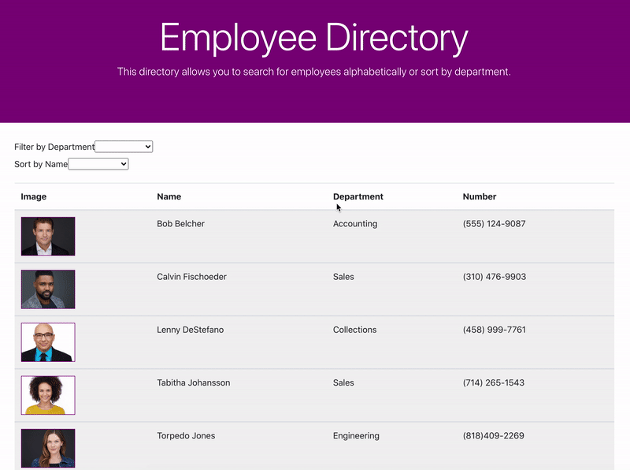

# 19-employee-directory

This is an application built with React that allows the user to search for employees by name alphabetically or sort through employees by department.


```
This screeshot shows the user searching for employees by the different methods.
```


## Deployed Link

* [See Live Site]()

## Prerequisites

You'll need an IDE such as VS Code or Atom. Copy and paste code into your IDE and you can save file to your local drive.

```
https://code.visualstudio.com/download

https://flight-manual.atom.io/getting-started/sections/installing-atom/
```

## Installing

- Clone the repository : https://github.com/GNoisy/19-employee-directory


## Built With

* [React](https://reactjs.org/)
* [Node.js](https://nodejs.org/en/)
* [Bootstrap](https://getbootstrap.com/)
* [HTML](https://developer.mozilla.org/en-US/docs/Web/HTML)
* [CSS](https://developer.mozilla.org/en-US/docs/Web/CSS)


## Author

* **Giovanni Noisy**

- [Github](https://github.com/GNoisy)
- [LinkedIn](https://www.linkedin.com/in/giovanni-noisy-04098989/)

### Acknowledgments

* MDN 
* w3schools